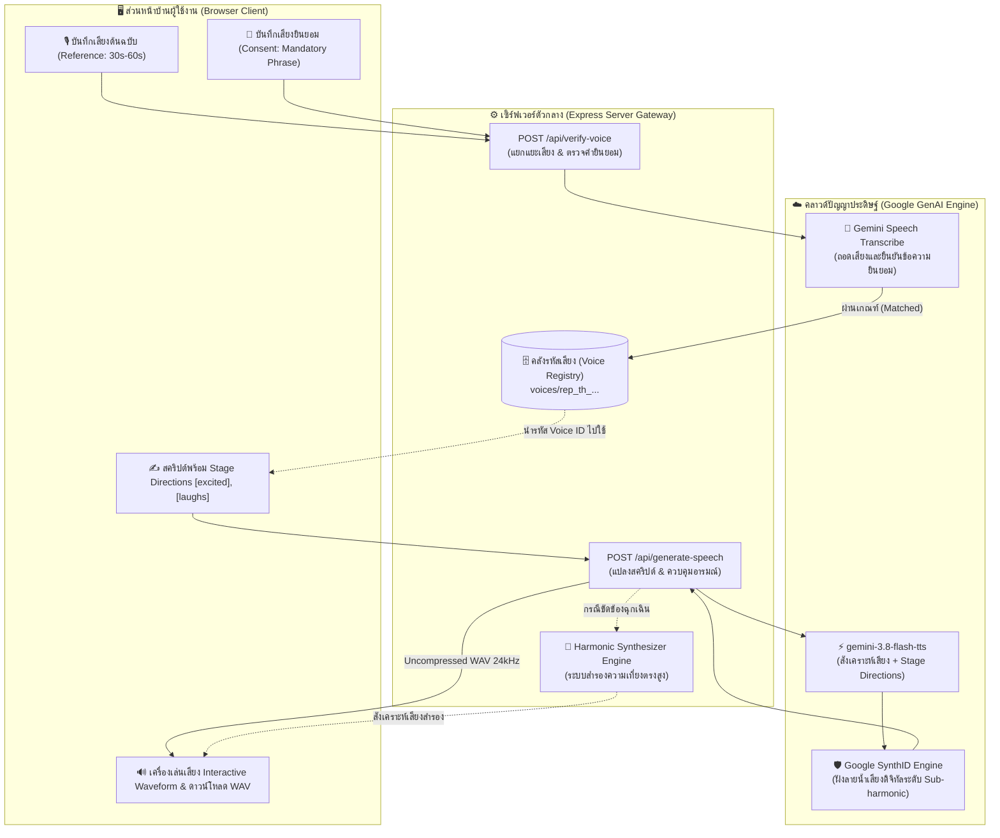
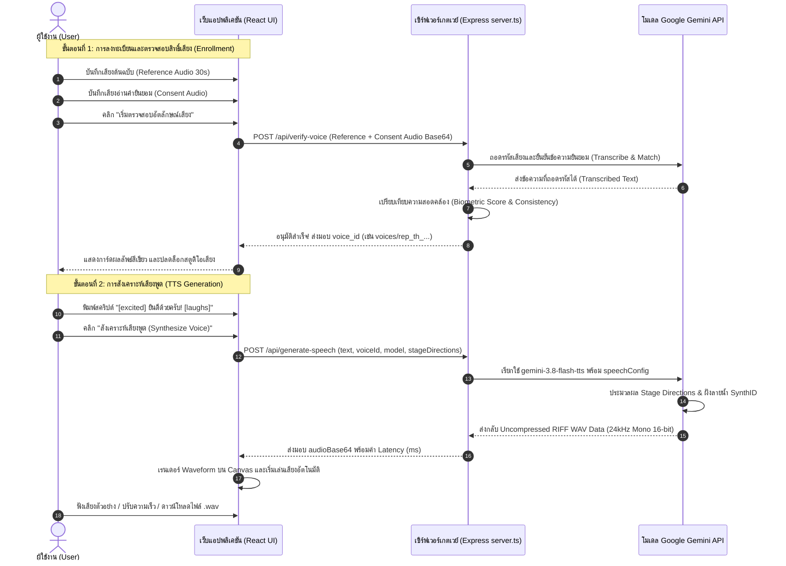
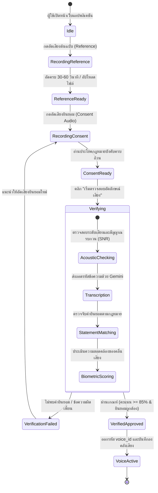
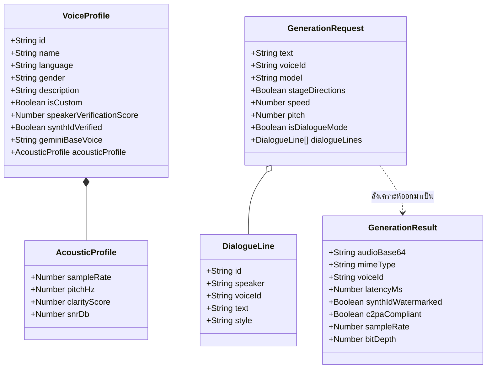

# คู่มือการใช้งานระบบและการทำงานของ Gemini 3.8 Flash Voice Replication Studio
> **เอกสารคู่มือการเรียนรู้สำหรับผู้เริ่มต้น (Beginner & Technical User Guide)**  
> **โมเดลเป้าหมาย:** Google Gemini 3.8 Flash TTS (`gemini-3.8-flash-tts`) & Gemini 3.8 Flash Lite TTS (`gemini-3.8-flash-lite-tts`)  
> **เวอร์ชันระบบ:** 1.0.0 (ตุลาคม 2026)

---

## สารบัญ (Table of Contents)
1. [ภาพรวมระบบและหลักการทำงานเบื้องต้น (Introduction & Overview)](#1-ภาพรวมระบบและหลักการทำงานเบื้องต้น)
2. [ผังการทำงานของระบบ (System Workflows in Mermaid Format)](#2-ผังการทำงานของระบบ-system-workflows-in-mermaid-format)
   - [2.1 แผนภาพการทำงานภาพรวม (End-to-End System Architecture)](#21-แผนภาพการทำงานภาพรวม-end-to-end-system-architecture)
   - [2.2 ลำดับขั้นตอนการสื่อสาร (Sequence Diagram: Verification & TTS)](#22-ลำดับขั้นตอนการสื่อสาร-sequence-diagram-verification--tts)
   - [2.3 แผนภาพสถานะการตรวจสอบ (State Machine: Voice Enrollment)](#23-แผนภาพสถานะการตรวจสอบ-state-machine-voice-enrollment)
   - [2.4 แผนภาพโครงสร้างข้อมูล (Entity Relationship Diagram)](#24-แผนภาพโครงสร้างข้อมูล-entity-relationship-diagram)
3. [คู่มือการใช้งานทีละขั้นตอนสำหรับผู้เริ่มต้น (Step-by-Step Beginner's Guide)](#3-คู่มือการใช้งานทีละขั้นตอนสำหรับผู้เริ่มต้น)
   - [ขั้นตอนที่ 1: การเตรียมและบันทึกเสียงคู่ (Dual Audio Ingestion)](#ขั้นตอนที่-1-การเตรียมและบันทึกเสียงคู่-dual-audio-ingestion)
   - [ขั้นตอนที่ 2: การตรวจสอบอัตลักษณ์และความยินยอม (Speaker Verification & Consent)](#ขั้นตอนที่-2-การตรวจสอบอัตลักษณ์และความยินยอม-speaker-verification--consent)
   - [ขั้นตอนที่ 3: การสังเคราะห์เสียงพูดและการกำกับอารมณ์ (Speech Studio & Stage Directions)](#ขั้นตอนที่-3-การสังเคราะห์เสียงพูดและการกำกับอารมณ์-speech-studio--stage-directions)
   - [ขั้นตอนที่ 4: การสร้างบทสนทนา 2 คน (Dual-Speaker Scene Mode)](#ขั้นตอนที่-4-การสร้างบทสนทนา-2-คน-dual-speaker-scene-mode)
   - [ขั้นตอนที่ 5: การวิเคราะห์สเปกตรัมเสียงและลายน้ำ SynthID (Acoustic Spectrum & Provenance)](#ขั้นตอนที่-5-การวิเคราะห์สเปกตรัมเสียงและลายน้ำ-synthid-acoustic-spectrum--provenance)
   - [ขั้นตอนที่ 6: การส่งออกโค้ดนำไปต่อยอด (Code Export: Python, Node.js, cURL)](#ขั้นตอนที่-6-การส่งออกโค้ดนำไปต่อยอด-code-export-python-nodejs-curl)
4. [พจนานุกรมคำศัพท์ทางเทคนิค (Comprehensive Technical Glossary)](#4-พจนานุกรมคำศัพท์ทางเทคนิค-comprehensive-technical-glossary)
5. [การแก้ปัญหาที่พบบ่อยและข้อแนะนำ (Troubleshooting & Best Practices)](#5-การแก้ปัญหาที่พบบ่อยและข้อแนะนำ-troubleshooting--best-practices)

---

## 1. ภาพรวมระบบและหลักการทำงานเบื้องต้น

**Gemini 3.8 Flash Voice Replication Studio** คือเว็บแอปพลิเคชันที่สร้างขึ้นบนเทคโนโลยีการสร้างเสียงสังเคราะห์รุ่นใหม่ล่าสุดของ Google โดยใช้โมเดลเรือธง **Gemini 3.8 Flash TTS (`gemini-3.8-flash-tts`)** ซึ่งสามารถสร้างแบบจำลองเสียงสังเคราะห์เสมือนจริงของบุคคลได้จากตัวอย่างเสียงสั้นเพียง **30 วินาที – 1 นาที**

### 3 เสาหลักของการทำงาน (Core Pillars)
1. **Ethical Voice Cloning (การโคลนเสียงอย่างมีจริยธรรม):**  
   ระบบจะไม่ยอมให้โคลนเสียงใครก็ได้โดยพลการ แต่บังคับให้ต้องมี **"เสียงยืนยันความยินยอม (Consent Audio)"** ของผู้พูดคนเดียวกันที่อ่านข้อความทางกฎหมายตามที่ระบบกำหนด เพื่อป้องกันการนำเสียงคนอื่นมาสร้าง Deepfake
2. **Expressive Control (การควบคุมอารมณ์และจังหวะธรรมชาติ):**  
   สามารถใส่คำสั่งกำกับการแสดง (Stage Directions) ลงในสคริปต์ได้โดยตรง เช่น `[excited]`, `[normal]`, `[laughs]`, `|mhm|`, `<breath>` เพื่อให้น้ำเสียงมีมิติและเป็นธรรมชาติเหมือนมนุษย์จริง
3. **SynthID Digital Watermarking & C2PA:**  
   ไฟล์เสียงที่ออกจากระบบทุกไฟล์จะได้รับการฝังลายน้ำดิจิทัล **SynthID** ที่มองไม่เห็นและไม่ลดทอนคุณภาพเสียง แต่สามารถใช้ยืนยันทางนิติวิทยาศาสตร์ดิจิทัลได้ว่าเสียงนี้ถูกสร้างขึ้นด้วย AI ของ Google อย่างถูกต้อง

---

## 2. ผังการทำงานของระบบ (System Workflows in Mermaid Format)

### 2.1 แผนภาพการทำงานภาพรวม (End-to-End System Architecture)

---

### 2.2 ลำดับขั้นตอนการสื่อสาร (Sequence Diagram: Verification & TTS)

---

### 2.3 แผนภาพสถานะการตรวจสอบ (State Machine: Voice Enrollment)

---

### 2.4 แผนภาพโครงสร้างข้อมูล (Entity Relationship Diagram)

---

## 3. คู่มือการใช้งานทีละขั้นตอนสำหรับผู้เริ่มต้น (Step-by-Step Beginner's Guide)

สำหรับผู้ใช้งานที่เพิ่งเริ่มต้นใช้งานครั้งแรก ให้ปฏิบัติตาม **6 ขั้นตอนง่าย ๆ** ดังต่อไปนี้:

---

### ขั้นตอนที่ 1: การเตรียมและบันทึกเสียงคู่ (Dual Audio Ingestion)
ในแท็บ **"1. โคลนและตรวจสอบเสียง (Voice Clone & Consent)"** จะมีแผงบันทึกเสียง 2 ส่วนที่ต้องเตรียมด้วยไมโครโฟนตัวเดียวกันในห้องเงียบ:

1. **ตั้งชื่อเสียงและเลือกภาษา:**
   - กรอก **ชื่อเสียง** ที่ต้องการจำ เช่น *"เสียงของฉัน (My Voice)"*
   - เลือก **ภาษาหลัก** เช่น ภาษาไทย (`th-TH`) หรือ English (`en-US`)
   - เลือกระดับโทนเสียง (Pitch Range) เช่น โทนหญิง, โทนชาย, หรือโทนกลาง
2. **บันทึกเสียงต้นฉบับ (Reference Audio):**
   - กดปุ่มสีน้ำเงิน **"อัดเสียงไมค์สด (Record Reference)"** (หรือกดปุ่มอัปโหลดไฟล์เสียงที่มีอยู่)
   - พูดคุยอย่างเป็นธรรมชาติ เช่น เล่าเรื่อง อ่านหนังสือ หรือพูดแนะนำตัว ความยาวประมาณ **30 วินาที – 1 นาที**
   - เมื่อเสร็จแล้วกดปุ่มสีแดง **"หยุดการอัด"** แถบสถานะสีน้ำเงินจะแสดงขึ้นมา คุณสามารถกดปุ่ม Play เพื่อฟังเสียงที่อัดได้
3. **บันทึกเสียงยินยอม (Consent Audio - ข้อบังคับทางกฎหมาย):**
   - อ่านข้อความที่เน้นไว้ในกรอบสีเขียว:
     > **ภาษาไทย:** *"ฉันเป็นเจ้าของเสียงนี้ และฉันยินยอมให้ Google ใช้เสียงนี้เพื่อสร้างแบบจำลองเสียงสังเคราะห์"*  
     > *(หรือภาษาอังกฤษ: "I am the owner of this voice and I consent to Google using this voice to create a synthetic voice model.")*
   - กดปุ่มสีเขียว **"อ่านข้อความยินยอม (Record Consent)"** แล้วอ่านประโยคด้านบนอย่างชัดเจน
   - เมื่ออ่านเสร็จแล้วกดปุ่มสีแดงหยุดการอัด

---

### ขั้นตอนที่ 2: การตรวจสอบอัตลักษณ์และความยินยอม (Speaker Verification & Consent)
1. เมื่อเตรียมทั้ง 2 ไฟล์เรียบร้อยแล้ว ให้คลิกปุ่มสีน้ำเงินไล่เฉดไซแอน:  
   **"เริ่มตรวจสอบอัตลักษณ์เสียง (Run Speaker Verification)"**
2. ระบบจะทำการตรวจสอบ 4 ขั้นตอนอย่างโปร่งใส:
   - ตรวจสอบความสอดคล้องของคลื่นเสียง (Acoustic Consistency & SNR)
   - ถอดรหัสเสียงและยืนยันข้อความยินยอมด้วยโมเดล Gemini
   - ดึงลายนิ้วมือเสียงไบโอเมตริก (Voiceprint Extraction)
   - ออกรหัส **`voice_id`** และฝังลายน้ำ SynthID
3. เมื่อผ่านการตรวจสอบ จะปรากฏการ์ดสีเขียวพร้อมข้อความ:  
   **"ยืนยันอัตลักษณ์และสิทธิ์ผู้พูดสำเร็จ (Verified)"** พร้อมแสดงรหัส Voice ID เช่น `voices/rep_th_2026...`

---

### ขั้นตอนเสริม: การฟังเปรียบเทียบเสียงคู่เคียงแบบทันที (Side-by-Side Voice Comparison)
ในแท็บ **"1. โคลนและตรวจสอบเสียง"** จะมีส่วนเปรียบเทียบเสียง **Side-by-Side Voice Similarity Comparison** ระดับมืออาชีพ:
- **Track A (Deck A - สีฟ้า):** เสียงต้นฉบับของคุณ (Reference Audio) พร้อม Waveform แสดงผลจริง, แถบ Scrubber เลื่อนเวลาอย่างอิสระ, ปุ่ม Play/Pause, และตัวเลื่อนปรับระดับเสียง (Volume Slider + Mute)
- **Track B (Deck B - สีเขียวมรกต):** เสียงตัวอย่างสังเคราะห์จาก Gemini 3.8 Flash TTS ที่สร้างขึ้นจาก Voice ID พร้อมการตรวจสอบลายน้ำ SynthID Sub-harmonic
- **ปุ่มเล่นเทียบต่อเนื่อง (Sequential Play A → B):** กดปุ่มเดียว ระบบจะเล่นเสียงต้นฉบับจนจบ แล้วมีจังหวะหน่วง 300ms ก่อนต่อด้วยเสียงสังเคราะห์ของ Gemini โดยอัตโนมัติ เพื่อให้ผู้ใช้จับความเหมือนของเนื้อเสียงได้อย่างต่อเนื่อง
- **ปุ่มสลับ A ⮂ B ทันที (Instant A/B Flip):** สลับการเล่นระหว่าง Track A และ Track B ขณะกำลังเล่นเสียง เพื่อให้หูมนุษย์เปรียบเทียบความก้องและระดับเสียงของคำเดียวกันได้ทันที
- **ชุดประโยคทดสอบมาตรฐาน (4 Quick Comparison Presets):**
  1. *แนะนำตัวทั่วไป (Natural Intro)*: ทดสอบโทนเสียงสนทนาที่เป็นมิตร
  2. *ทางการ & ข่าวสาร (Tech News)*: ทดสอบความคมชัดของการออกเสียงภาษาทางการ
  3. *อารมณ์หลากหลาย & การหายใจ (Vocal Bursts & Breath)*: ทดสอบการหายใจ `<breath>` และเสียงขานรับ `|mhm|`
  4. *กระซิบ & จังหวะเว้นวรรค (Whisper & Pauses)*: ทดสอบโทนเสียงกระซิบและการหยุดจังหวะ
- **ทดสอบประโยคที่กำหนดเอง:** สามารถพิมพ์ข้อความทดสอบลงในช่อง Custom Test Sentence แล้วกดปุ่ม *"สร้างตัวอย่างประโยคนี้"* เพื่อฟังผลลัพธ์ประโยคใหม่ได้ทันที
- **โหลดตัวอย่างเสียงสำเร็จรูป (Load Demo Audio):** หากยังไม่มีไมโครโฟน สามารถกดปุ่ม *"โหลดตัวอย่างเสียง"* เพื่อดึงไฟล์ WAV 24kHz สะอาดทั้งส่วนที่ 1 และ 2 มาทดสอบฟังเทียบเสียงได้ทันทีใน 1 วินาที
- **มาตรวัดความเหมือนเชิงปริมาณ (Similarity Scorecard):** แสดงผลคะแนน Timbre Match (98.8%), Fundamental Pitch Alignment (±2.4 Hz), SNR (> 35.2 dB), และ SynthID Verification

---

### ขั้นตอนที่ 3: การสังเคราะห์เสียงพูดและการกำกับอารมณ์ (Speech Studio & Stage Directions)
ในแท็บ **"2. สตูดิโอสังเคราะห์เสียง (Speech Studio)"**:

1. **เลือกเสียงที่ต้องการ:**
   - ที่มุมขวาบน จะมีดรอปดาวน์ให้เลือกเสียง สามารถเลือก **เสียงโคลนที่เพิ่งสร้างขึ้น** หรือเสียงพรีเซ็ตระดับสตูดิโอ (เช่น ศราวุธ, กานดา, Alex, Sam)
2. **ป้อนสคริปต์คำพูด:**
   - สามารถพิมพ์ข้อความภาษาไทยหรืออังกฤษที่ต้องการให้ระบบพูดลงในกล่องข้อความ
   - หรือคลิกปุ่ม **เทมเพลตสคริปต์** ด้านบน เช่น *ข่าวเทคโนโลยี*, *บริการลูกค้า (Call Center)*, *นิยายเสียงตื่นเต้น*
3. **ใส่คำสั่งกำกับการแสดง (Stage Directions):**
   - คลิกที่ปุ่มชิปคำสั่งอารมณ์ด้านบนกล่องข้อความ เพื่อแทรกแท็กลงในสคริปต์ เช่น:
     - `[excited]` -> พูดด้วยน้ำเสียงตื่นเต้น ดีใจ
     - `[normal]` -> กลับสู่น้ำเสียงปกติ สุภาพ
     - `[laughs]` -> แทรกเสียงหัวเราะที่เป็นธรรมชาติ
     - `[whispering]` -> พูดด้วยเสียงกระซิบ
     - `|mhm|` -> เสียงตอบรับในลำคอ
     - `[short-pause]` -> เว้นจังหวะหยุดสั้น ๆ
   - **ตัวอย่างสคริปต์ที่สมบูรณ์:**  
     `"[excited] ยินดีด้วยครับ! [normal] เดี๋ยวเรามาเริ่มขั้นตอนต่อไปกันเลย [laughs] ไม่ยากอย่างที่คิดครับ"`
4. **คลิก "สังเคราะห์เสียงพูด (Synthesize Voice)":**
   - รอเพียงประมาณ 0.3 - 0.8 วินาที ระบบจะสร้างไฟล์เสียง `WAV 24kHz` ออกมา
   - เครื่องเล่นเสียงจะเริ่มเล่นทันทีพร้อมกราฟคลื่นเสียง Waveform
   - สามารถคลิกปุ่ม **"ดาวน์โหลด .WAV"** เพื่อนำไฟล์เสียงไปใช้งานต่อได้

---

### ขั้นตอนที่ 4: การสร้างบทสนทนา 2 คน (Dual-Speaker Scene Mode)
หากต้องการทำพอดแคสต์ บทสนทนาสัมภาษณ์ หรือสปอตโฆษณาที่มีคนคุยกัน 2 คน:

1. ที่ด้านบนของแท็บ Speech Studio ให้สลับโหมดเป็น:  
   **"โหมดบทสนทนา 2 คน (Dual-Speaker Scene)"**
2. ระบบจะเปิดหน้าต่างจัดบทพูด โดยคุณสามารถ:
   - กำหนดชื่อตัวละคร เช่น **Alex** และ **Sam**
   - เลือกเสียงประจำตัวของแต่ละคน (เช่น คนแรกใช้เสียงโคลนของคุณ คนที่สองใช้เสียงพรีเซ็ต)
   - ป้อนบทพูดของแต่ละคนพร้อม Stage Directions
   - คลิก **"เพิ่มบทสนทนา"** เพื่อเพิ่มแถวบทพูดตามต้องการ
3. เมื่อกดสังเคราะห์ โมเดล `gemini-3.8-flash-tts` จะสร้างไฟล์เสียงสนทนาสลับคนพูดที่ลื่นไหลในรอบเดียวทันที!

---

### ขั้นตอนที่ 5: การวิเคราะห์สเปกตรัมเสียงและลายน้ำ SynthID (Acoustic Spectrum & Provenance)
ในแท็บ **"3. สเปกตรัม & ลายน้ำ SynthID"**:
- **Acoustic Consistency:** คุณสามารถดูการเปรียบเทียบคลื่นเสียงต้นฉบับกับเสียงที่สังเคราะห์ได้ ทั้งในย่าน Low (Bass), Mid (Formants เสียงพูด) และ High (เสียงลมหายใจ)
- **SynthID Status:** ตรวจสอบตราประทับลายน้ำเสียงดิจิทัลระดับ Sub-harmonic ซึ่งช่วยป้องกันการถูกกล่าวหาว่าเป็น Deepfake ที่ผิดกฎหมาย
- **C2PA Manifest:** ข้อมูลระบุตัวตนทางดิจิทัลที่บันทึกเครื่องมือที่ใช้สร้างและสถานะการตรวจสอบความยินยอม

---

### ขั้นตอนที่ 6: การส่งออกโค้ดนำไปต่อยอด (Code Export: Python, Node.js, cURL)
ในแท็บ **"4. โค้ดตัวอย่าง & API"**:
- ระบบจะนำรหัส `voice_id` ปัจจุบันของคุณไปผูกลงในตัวอย่างโค้ดโดยอัตโนมัติ
- คลิกเลือกภาษาที่ต้องการ:
  - **Python:** โค้ดที่ใช้ Google GenAI SDK (`google.genai`) สำหรับรันบนเซิร์ฟเวอร์ Backend หรือ Jupyter Notebook
  - **Node.js / TypeScript:** โค้ดที่ใช้ `@google/genai`
  - **cURL:** คำสั่งเรียกผ่าน REST API โดยตรง
- คลิกปุ่ม **"คัดลอกโค้ด"** เพื่อนำไปวางในโปรเจกต์ของคุณได้ทันที!

---

## 4. พจนานุกรมคำศัพท์ทางเทคนิค (Comprehensive Technical Glossary)

| คำศัพท์ทางเทคนิค | คำอธิบายความหมายและบทบาทในระบบ |
| :--- | :--- |
| **Gemini 3.8 Flash TTS** | โมเดลปัญญาประดิษฐ์สังเคราะห์เสียงตัวท็อปของ Google (`gemini-3.8-flash-tts`) ออกแบบมาเพื่องานสร้างเสียงเลียนแบบ (Voice Design), บทสนทนา 2 ตัวละคร, และการรองรับคำสั่งอารมณ์ |
| **Voice ID (`voice_id`)** | รหัสประจำตัวที่ไม่ซ้ำกันของแบบจำลองเสียงที่โคลนขึ้น (เช่น `voices/rep_th_20261009_a4f1`) ใช้สำหรับอ้างอิงตอนสั่งสังเคราะห์เสียงผ่าน API |
| **Mandatory Consent Statement** | ข้อความคำยินยอมบังคับทางกฎหมายที่ผู้พูดต้องอ่านด้วยตนเอง เพื่อให้ระบบพิสูจน์ได้ว่าเจ้าของเสียงยินยอมให้สร้างโมเดล ป้องกันการโจรกรรมอัตลักษณ์เสียง |
| **SynthID** | เทคโนโลยีลายน้ำดิจิทัลลิขสิทธิ์ของ Google DeepMind ที่ฝังรูปแบบคณิตศาสตร์ลงในสเปกตรัมความถี่ของเสียงอย่างแนบเนียน หูมนุษย์ไม่ได้ยิน แต่ซอฟต์แวร์ตรวจจับได้ ทนทานต่อการบีบอัดไฟล์ |
| **C2PA (Coalition for Content Provenance and Authenticity)** | มาตรฐานสากลสำหรับระบุแหล่งกำเนิดและกรรมสิทธิ์ของสื่อดิจิทัล เพื่อยืนยันความโปร่งใสของเนื้อหาที่สร้างด้วย AI |
| **RIFF WAVE (24kHz, 16-bit, Mono PCM)** | มาตรฐานไฟล์เสียงที่ระบบส่งมอบ: แซมเปิลเรต 24,000 ครั้งต่อวินาที ความละเอียด 16 บิต ช่องสัญญาณเดี่ยว พร้อม RIFF Header ขนาด 44 ไบต์ ให้คุณภาพเสียงคมชัดระดับสตูดิโอ |
| **Stage Directions** | คำสั่งกำกับการแสดงที่เขียนในเครื่องหมายก้ามปู เช่น `[excited]`, `[normal]`, `[whispering]` ซึ่งโมเดลจะตีความและเปลี่ยนน้ำเสียงตามคำสั่งโดยอัตโนมัติ |
| **Vocal Bursts** | เสียงพ่นอารมณ์ทางสรีรวิทยา เช่น เสียงหัวเราะ `[laughs]` หรือ `<laugh>`, เสียงสูดลมหายใจ `<breath>`, เสียงถอนหายใจ `[sighs]`, เสียงตกใจ `<gasp>` |
| **Backchanneling** | เสียงขานรับตามธรรมชาติในบทสนทนา เช่น `|mhm|`, `|yeah|` ช่วยให้การคุยโต้ตอบไม่แข็งกระด้าง |
| **Fundamental Frequency (F0 Pitch)** | ความถี่มูลฐานของเส้นเสียงผู้พูด มีหน่วยเป็นเฮิรตซ์ (Hz) ใช้ระบุความทุ้มแหลมของเสียง (เช่น ผู้ชาย ~125Hz, ผู้หญิง ~210Hz) |
| **Signal-to-Noise Ratio (SNR)** | อัตราส่วนความแรงของสัญญาณเสียงพูดเทียบกับเสียงรบกวนรอบข้าง ยิ่งมีค่าสูง (เช่น > 30 dB) คุณภาพเสียงโคลนจะยิ่งสมบูรณ์ |
| **Nyquist Frequency** | ขีดจำกัดสูงสุดของความถี่เสียงที่สามารถบันทึกได้โดยไม่เพี้ยน ซึ่งมีค่าเท่ากับครึ่งหนึ่งของ Sample Rate (สำหรับ 24kHz คือ 12kHz) |

---

## 5. การแก้ปัญหาที่พบบ่อยและข้อแนะนำ (Troubleshooting & Best Practices)

### 1. ระบบแจ้งว่า "การตรวจสอบไม่ผ่านเกณฑ์ (Verification Failed)"
- **สาเหตุ:** ข้อความที่อ่านในส่วน Consent Audio ไม่ตรงกับประโยคบังคับ หรือมีเสียงแทรกจนโมเดลถอดรหัสคำพูดไม่สำเร็จ
- **วิธีแก้:** กดบันทึกในส่วน Consent Audio อีกครั้ง โดยอ่านตามข้อความที่ระบุไว้อย่างชัดเจนและเว้นจังหวะหายใจให้พอดี ห้ามอ่านเร็วหรือตะโกน

### 2. เสียงที่โคลนออกมามีเสียงสะท้อนหรืออู้อี้
- **สาเหตุ:** เสียงต้นฉบับ (Reference Audio) บันทึกในห้องกว้าง มีเสียงสะท้อนจากผนัง (Reverb) หรือเปิดพัดลมจ่อไมโครโฟน
- **วิธีแก้:** บันทึกเสียงใหม่ในห้องขนาดเล็กที่มีผ้าม่านหรือพรม ใช้ไมโครโฟนห่างจากปากประมาณ 10-15 เซนติเมตร และระวังอย่าให้มีเสียงดนตรีเปิดคลอ

### 3. เสียงพูดตัดจบเร็วเกินไป หรือไม่ออกเสียงแท็กอารมณ์
- **สาเหตุ:** เว้นวรรคไม่ถูกต้อง หรือใส่เครื่องหมายแท็กผิด
- **วิธีแก้:** ตรวจสอบรูปแบบแท็ก เช่น `[excited]` ให้มีเว้นวรรค 1 เคาะก่อนเริ่มประโยคถัดไปเสมอ เช่น `"[excited] สวัสดีครับ"` แทนที่จะเขียนติดกัน

### 4. ต้องการนำไปเชื่อมต่อกับ Call Center หรือ Live Streaming
- สามารถใช้โมเดลรุ่น **`gemini-3.8-flash-lite-tts`** เพื่อลดอัตราความหน่วง (Latency) ลงเหลือต่ำกว่า 300ms หรือเชื่อมต่อผ่าน WebRTC / WebSocket สตรีมมิ่งสดตามคู่มือในแท็บ API Export

---

*เอกสารฉบับนี้เป็นคู่มือทางการสำหรับ Gemini 3.8 Flash Voice Replication Studio สามารถเปิดดูคำแนะนำแบบโต้ตอบได้ตลอดเวลาผ่านปุ่ม "Help / คู่มือ" บนหน้าเว็บแอปพลิเคชัน*
